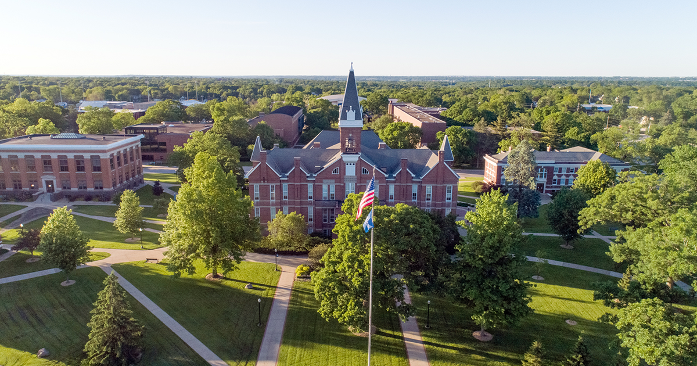

{: style="max-height:400px; width: auto; display: block; margin: 0 auto;" }

Welcome to the 31st annual Consortium for Computing Sciences in Colleges Central Plains Region Conference, which includes opportunities to see great research papers on a variety of topics in CS education; workshops on teaching with generative AI, collaborative projects, Codespaces, and containers; nifty assignments, and a panel on developing academic programs focusing on AI. We are also looking forward to showcasing students with a research poster competition, a hackathon, and a programming competition.

We are especially excited about our keynote speakers. Meredith Moore will share her expertise on accessible computing and what every CS educator should know. John Emmons will share on experiences in leading AI teams. 

This conference would not be possible without the dedication of many contributors. We extend our gratitude to the authors who submitted their work, the reviewers who ensured a high-quality program with a 53% paper acceptance rate, the committee members who planned and organized the event, the session moderators, and all the on-site volunteers working to create a pleasant experience for everyone. And, thank you to our [national partners](https://www.ccsc.org/partners/) for their very generous support!

We hope you have a an enjoyable and enlightening conference!

